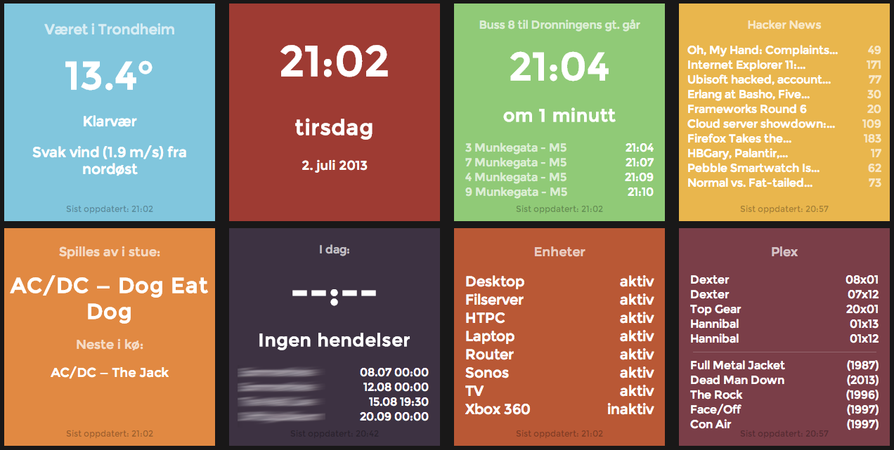
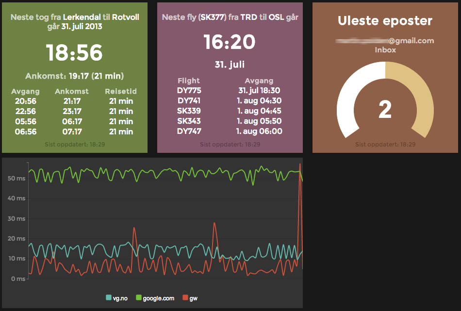

JARVIS v2
=========

JARVIS is a dashboard framework designed to run on the Raspberry Pi.

It features live-updating widgets using
[server-sent events](http://en.wikipedia.org/wiki/Server-sent_events) and can be
easily extended to fit your needs.

The framework is written in Python and is a new and improved version of the old
[JARVIS](https://github.com/martinp/jarvis) project.

Screenshots
-----------

Dependencies
------------
JARVIS requires Python 2.6+ or Python 3.3+ to run.

Some dependencies have native bindings which requires these packages on
Debian/Ubuntu:

    aptitude install -y python-dev libxml2-dev libxslt1-dev zlib1g-dev

Install requirements:

    pip install -r requirements.txt

For development it's recommended to use [virtualenv](http://www.virtualenv.org).

Configuration
-------------
All configuration of widgets is done in a single Python source file. The
configuration is specified by setting the `JARVIS_SETTINGS` environment
variable.

A sample config (`app/config.py.sample`) is provided. This file can be used as a
starting point for your own configuration.

Copy `app/config.py.sample` to `app/config.py` and edit it to suit your needs.

Usage
-----
After installing dependencies and creating a config file, the app can be started
by running:

    JARVIS_SETTINGS=config.py make run

To start the app in debug mode, use:

    JARVIS_SETTINGS=config.py make debug

Run a job standalone and pretty-print output (useful for debugging):

    JARVIS_SETTINGS=config.py make run-job

Create Google API credentials (required for calendar and gmail widget):

    JARVIS_SETTINGS=config.py make google-api-auth

Create a new widget:

    make widget

Create a new dashboard:

    make dashboard

Widgets
-------
See [WIDGETS.md](docs/WIDGETS.md) for documentation on available widgets.

Deployment
----------
See [INSTALL.md](docs/INSTALL.md) for a basic deployment guide.

Development environment
-----------------------
A `Vagrantfile` is included for use with [Vagrant](http://www.vagrantup.com).
[Ansible](http://www.ansible.com) is used for provisioning the Vagrant box and
must be installed on your host machine.

Run `vagrant up` in the repository root to provision a development environment.

License
-------
Licensed under the MIT license. See the [LICENSE](LICENSE) file if you've never
seen it before.
